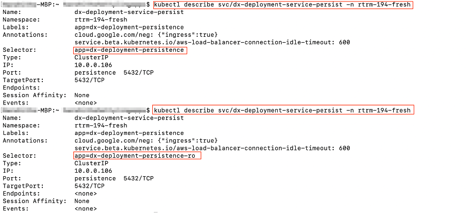
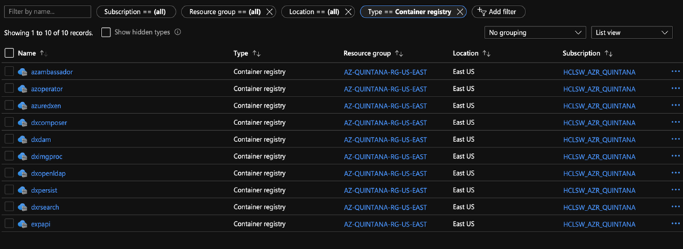
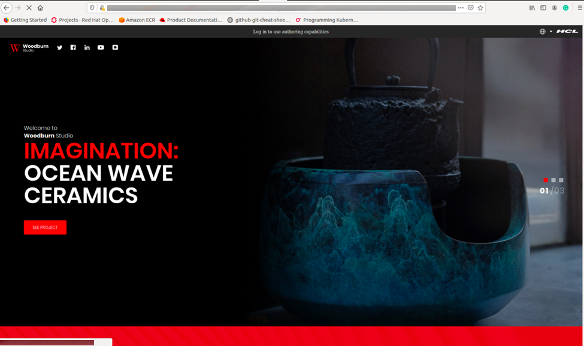
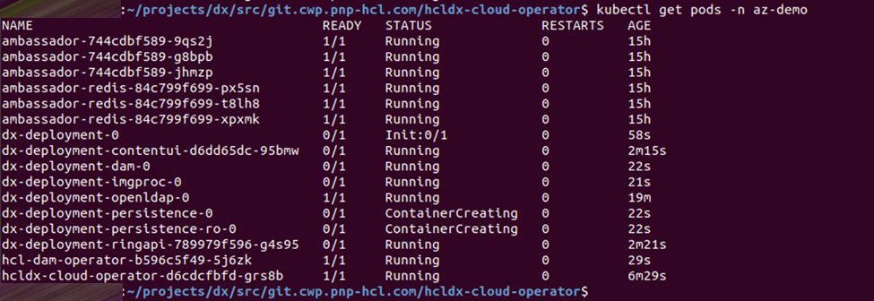
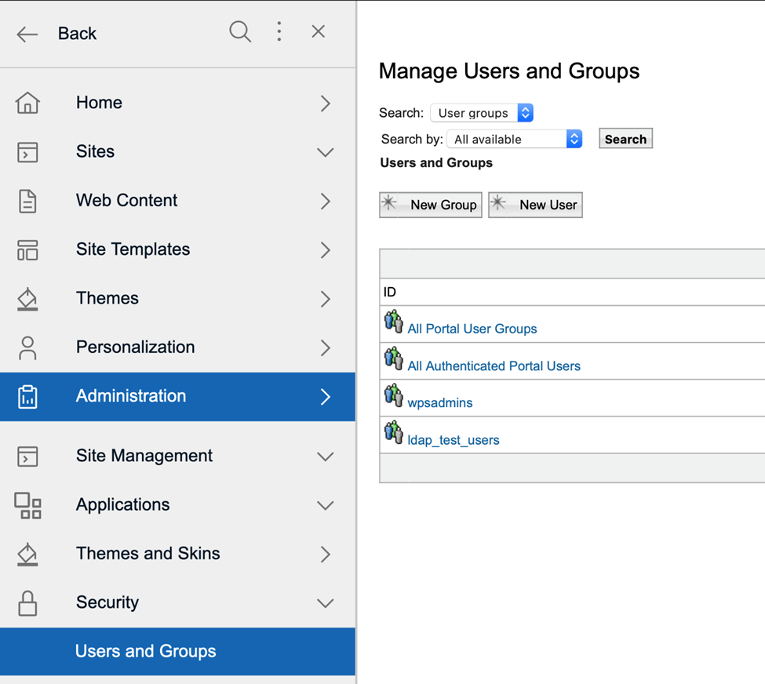
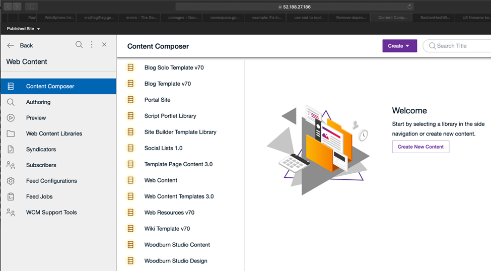
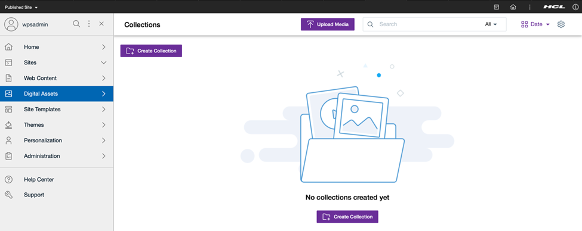

# Deploy DX Container to Microsoft Azure Kubernetes Service \(AKS\)

Learn how to deploy HCL Digital Experience \(DX\) 9.5 CF182 and later container release along with Ambassador to Kubernetes, as verified in Microsoft Azure Kubernetes Service \(AKS\).

## About this task

Follow these steps to deploy HCL Digital Experience 9.5 CF182 and later container release along with Ambassador to Kubernetes, as verified in [Microsoft Azure Kubernetes Service \(AKS\)](https://azure.microsoft.com/en-us/services/kubernetes-service/). This deployment relies heavily on Kubernetes Operators for full functionality.

If deploying HCL DX 9.5 Container Update CF191 and earlier, view the instructions to deploy using script commands instead of the dxctl tool as described below in this Help Center section.

**Note:** Reference the latest HCL DX 9.5 Container Release and Update file list in the [Docker deployment](../containerization/docker.html) topic.

## Prerequisites

Prior to using the procedure below, it is assumed that the HCL DX Administrator is generally experienced in using Kubernetes. Additionally, the DX Administrator must have the appropriate access to the target environment. If not, following are some preliminary steps that must be taken.

1.  Setup `KUBECONFIG` to refer to the target server. This ensures any `kubectl` commands executed locally affect the target environment.

    **Example:**

    

2.  Use `kubectl get {pods, pv, storageclass}` to get appropriate information from the artifacts running in the target Kubernetes environment.
3.  The following tools must be installed on a machine other than the Portal server:
    -   Docker
    -   Microsoft Azure CLI
    -   If deploying Digital Experience Container Update CF192 and later, the [dxctl tool](../containerization/dxtools_dxctl.html) is used to install and configure the deployment
4.  Volume requirement:
    -   It requires an AccessMode of **ReadWriteMany**.
    -   It requires a minimum of **40 GB**, with the default request set to **100 GB**.
    -   RECLAIM POLICY = **Retain**

        **Note:** HCL Digital Experience is input-output \(I/O\) intensive and requires a high performing file system for optimization.

5.  Azure container registry \(For tagging and pushing\).

## Deploying HCL Digital Experience \(DX\) 9.5 CF192 and later version

Follow these steps to deploy the HCL Digital Experience \(DX\) 9.5 CF192 and later container release to the Microsoft Azure AKS platform:

1.  Download the HCL Digital Experience Container Update CF192 and later release container product and extract it to your local file system. The file system can be on a local workstation or cloud platform.

    If deploying HCL DX 9.5 Container Update CF192 release, the image and package names are as follows:

    **CF192-core.zip** files:

    -   ```
HCL DX notices V9.5 CF192.txt
```

    -   ```
dxclient_v1.2.0_20210305-1758.zip
```

    -   ```
hcl-dx-ambassador-image-154.tar.gz
```

    -   ```
hcl-dx-cloud-operator-image-v95_CF192_20210305-2309.tar.gz
```

    -   ```
hcl-dx-cloud-scripts-v95_CF192_20210305-2309.zip
```

    -   ```
hcl-dx-content-composer-image-v1.6.0_20210305-1756.tar.gz
```

    -   ```
hcl-dx-core-image-v95_CF192_20210305-1758.tar.gz
```

    -   ```
hcl-dx-digital-asset-management-operator-image-v95_CF192_20210305-1757.tar.gz
```

    -   ```
hcl-dx-digital-asset-manager-image-v1.6.0_20210305-1802.tar.gz
```

    -   ```
hcl-dx-experience-api-sample-ui-v0.2.0.20210305-1805.zip
```

    -   ```
hcl-dx-image-processor-image-v1.6.0_20210305-1758.tar.gz
```

    -   ```
hcl-dx-openldap-image-v1.0.0-master_20210305_1614986151.tar.gz
```

    -   ```
hcl-dx-postgres-image-v1.6.0_20210305-1800.tar.gz
```

    -   ```
hcl-dx-redis-image-5.0.1.tar.gz
```

    -   ```
hcl-dx-remote-search-image-v95_CF192_20210305-1758.tar.gz
```

    -   ```
hcl-dx-ringapi-image-v1.6.0_20210305-1802.tar.gz
```

2.  Log in to your Microsoft Azure AKS platform.

    For more information, refer to the [Microsoft Azure documentation](https://docs.microsoft.com/en-us/cli/azure/install-azure-cli) if the Microsoft Azure CLI needs to be installed.

    Example log in command:

    ```
    az login
    ```

    **Example:**

    

3.  Create a resource group in Microsoft Azure using the following command:

    ```
    az group create --name <resourceGroupName> --location <region>
    ```

    **Example:**

    

    **Azure Console Example:**

    

    For more information, refer to the [Microsoft Azure documentation on Resource](https://docs.microsoft.com/en-us/cli/azure/group?view=azure-cli-latest#az_group_create).

4.  Create a Microsoft Azure Container Registry \(ACR\) to push the HCL DX 9.5 CF192 and later container images to.

    **Azure Console Example:**

    

    Once the ACR gets created, log in using the following command:

    ```
    az acr login --name <containerRegistry>
    ```

    **Example:**

    

    For more information, refer to the [Microsoft Azure documentation on Container Registry](https://docs.microsoft.com/en-us/cli/azure/acr?view=azure-cli-latest#az_acr_create).

5.  Set up the NFS server.

    Provide the **HCL DX 9.5 CF192** and later Docker image access to the volume mount created in order to copy the profile.

    There are various ways to do this, and NFS is one option. If NFS is used, here are the parameters that have been tested to work:

    -   **`rw`**

        Default.

    -   **`sync`**

        Default after NFS 1.0, means that the server does not reply until after the commit.

    -   **`insecure`**

        Requires requests originate on ports less than 1024. \*\*

    -   **`root_squash`**

        Map requests to the nobody user.\*\*

    -   **`Hard`**

        Required because this means the system keeps trying to write until it works.\*\*

    -   **`nfsvers=4.1`**
    -   **`rsize=8388608`**

        Avoids dropped packages, default 8192.

    -   **`wsize=8388608`**

        Avoids dropped packages, default 8192

    -   **`timeo=600`**

        60 seconds.

    -   **`retrans=2`**

        Number of retries after a time out.

    -   **`noresvport`\*\***

        Tells the NFS client to use a new Transmission Control Protocol \(TCP\) source port when a network connection is reestablished. Doing this helps make sure that the EFS file system has uninterrupted availability after a network recovery event.

    **Note:**

    -   Those marked with \(\*\*\) are critical and, in many cases, it is recommended to have the `rsize` and `wsize` set to 8388608.
    For more information, refer to the [Microsoft Azure documentation on Storage](https://docs.microsoft.com/en-us/cli/azure/storage/account?view=azure-cli-latest#az_storage_account_create).

6.  Configure the Microsoft Azure Kubernetes cluster. To configure `kubectl` to connect to your Kubernetes cluster, use the `az aks get-credentials` command.

    **Example:**

    ```
    az aks get-credentials --resource-group <resourcegroup> --name <clusterName>
    ```

    

    For more information, refer to the [Microsoft Azure documentation on Cluster](https://docs.microsoft.com/en-us/cli/azure/aks?view=azure-cli-latest#az_aks_create).


## DX-Container Image Management

1.  Change directory.

    Open a terminal window and change to the root directory of the extracted package.

2.  Docker load, tag and push by using the following commands:

    -   **List Docker images**

        ```
        docker images
        ```

    -   **Docker load**

        Load the containers into your Docker repository:

        ```
        docker load -i hcl-dx-core-image-v95_CF192_20210225-035822.tar.gz
        ```

        ```
        docker load -i hcl-dx-ambassador-image-154.tar.gz
        ```

        ```
        docker load -i hcl-dx-cloud-operator-image-v95_CF192_20210225-0546.tar.gz
        ```

        ```
        docker load -i hcl-dx-redis-image-5.0.1.tar.gz
        ```

    -   **ACR details**

        To tag and push the images to ACR, obtain login server details:

        ```
        az acr list --resource-group <resourceGroup> --query "[].{acrLoginServer:loginServer}" --output table
        ```

        %20details.png)

    -   **Docker tag**

        Tag your images using the `tag` command as shown in the examples below:

        ```
        docker tag SOURCE_IMAGE[:TAG] TARGET_IMAGE[:TAG]
        ```

        **Example:**

        ```
        docker tag hcl/dx/core:v95_CF192_20210225-035822 YOUR_CONTAINER.azurecr.io/hcl/dx/core:v95_CF192_20210225-035822
        ```

        ```
        docker tag hcl/dx/cloud-operator:v95_CF192_20210225-0546-YOUR_CONTAINER.azurecr.io/hcl/dx/cloud-operator:v95_CF192_20210225-0546
        ```

        ```
        docker tag hcl/dx/ambassador:YOUR_CONTAINER.azurecr.io/hcl/dx/ambassador:154
        ```

        ```
        docker tag hcl/dx/redis:5.0.1 YOUR_CONTAINER.azurecr.io/hcl/dx/redis:5.0.1
        ```

    -   **Docker push**

        Push the images to ACR using the following `push` command:

        ```
        docker push [OPTIONS] NAME[:TAG]
        ```

        **Example commands:**

        ```
        docker push YOUR_CONTAINER.azurecr.io/hcl/dx/core:v95_CF192_20210225-035822
        ```

        ```
        docker push YOUR_CONTAINER.azurecr.io/hcl/dx/cloud-operator:v95_CF192_20210225-0546
        ```

        ```
        docker push YOUR_CONTAINER.azurecr.io/hcl/dx/ambassador:154
        ```

        ```
        docker push YOUR_CONTAINER.azurecr.io/hcl/dx/redis:5.0.1
        ```

    Once the images are pushed, they can be listed using the commands below, or through use of the Microsoft Azure Kubernetes platform console.

    **Command Example:**

    ```
    az acr repository list --name <acrName> --output table
    ```

    **Microsoft Azure AKS Console - DX 9.5 example:**

    


## DX-Deployment using `dxctl`

1.  Create a `StorageClass`.

    **Sample StorageClass YAML:**

    ```
    kind: StorageClass
    apiVersion: storage.k8s.io/v1
    metadata:
      name: dx-deploy-stg
    provisioner: example.com/nfs
    
    ```

2.  Create a Persistence Volume \(pv\) with `AccessMode` as ReadWriteMany and reclaim policy as Retain.

    **Sample PV YAML:**

    ```
    apiVersion: v1
    kind: PersistentVolume
    metadata:
      name: blrcaps-core-3
    spec:
      capacity:
        storage: 100Gi
      accessModes:
      - ReadWriteMany
      nfs:
        path: NFS_PATH
        server: NFS_SERVER
      persistentVolumeReclaimPolicy: Retain
      storageClassName: dx-deploy-stg
      mountOptions:
        - hard
        - nfsvers=4.1
        - rsize=10485760
        - wsize=10485760
        - timeo=600
        - retrans=2
        - noresvport
    ```

    **Note:** Make sure the `PV` is available. If it is not, remove `claimRef:` from the YAML file.

3.  Log in to the cluster.

    Before using the `dxctl` tool to deploy, you must be logged in to the targeted cluster using the cloud platform specific CLI \(Red Hat OpenShift, Amazon EKS, Microsoft Azure AKS, Google GKE\).

    **Example:**

    ```
    az login
    ```

4.  Download `dxctl`.

    Instructions for downloading the latest packages are available [here](https://support.hcltechsw.com/csm?id=kb_article&sysparm_article=KB0077878&sys_kb_id=2cde06a31b885494c48197d58d4bcbe2).

    Once downloaded and extracted, the `hcl-dx-cloud-scripts` directory structure is as follows:

    

    For more information about `dxctl`, visit the following documentation [here](https://pages.git.cwp.pnp-hcl.com/Team-Q/documentation/docs/containerization/dxctl_tool).

5.  Configure and deploy using the HCL DX `dcxtl` tool.

    To start, change to the extracted files directory using the following command:

    ```
    cd hcl-dx-cloud-scripts
    ```

    Using DX Container Update CF192 and later, the directory structure appears as follows:

    

6.  Configure the `dxctl` properties for the DX 9.5 Container CF192 and later deployment.

    Copy one of the provided properties files to further modify for your deployment. The modified properties file can be used for the deployment and the same file must be used for further updates.

    **Example:**

    ```
    mkdir -p /home/$USER/deployments/
    ```

    ```
    cp dxctl/properties/full-deployment.properties /home/$USER/deployments/myfirst_deployment.properties
    ```

    Then, update the `dxctl` properties file values.

    **Sample values:**

    ```
    dx.namespace: endgametest-jeet1
    dx.image: dxen
    dx.tag: v95_CF192_20210225-035822_rohan_release_95_CF192_60374773
    dx.storageclass:dx-deploy-stg
    dx.volume: jeet3
    dx.volume.size:100
    remote.search.enabled:false
    openldap.enabled:false
    api.enabled: false
    composer.enabled: false
    dam.enabled: false
    ingress.image:dx-build-output/common/ambassador
    ingress.tag:1.5.4
    ingress.redis.image:redis
    ingress.redis.tag:5.0.1
    dx.operator.image: dx-build-output/hcldx-cloud-operator/hcldx-cloud-operator
    dx.operator.tag: v95_CF192_20210225-0546_xxxxxxxxx_95_CF192
    ```

    **Important:** With HCL DX 9.5 Container Update CF197 and later, dam.features in full-deployment properties is added for use in a future container update release, and should not be modified except with direct guidance from HCL Support.

    **Note:** With HCL DX 9.5 Container Update CF193 and later, persist.force.read in full-deployment properties is added to enable a read-only Postgres pod for Digital Asset Management. This enables a failover capability for the Postgres service supporting DAM. Another option to enable a read-only pod is to set the persist.minreplicas: option set to greater than 1.

    Example:

    

7.  Deploy using `dxctl`.

    Run the following command to deploy HCL DX 9.5 Container Update CF192 and later to Microsoft Azure AKS:

    ```
    ./mac/dxctl --deploy -p /home/$USER/deployments/myfirst_deployment.properties
    ```

    **Example:**

    

    **Note:** This set of steps result in a deployment being created.

8.  Validate the deployment.

    Make sure all the pods are "Running" and in "Ready" state on your Microsoft Azure AKS platform, as shown in the example below:

    


## Generate TLS Certificate

Create a TLS certification to be used by the deployment. Prior to this step, create a self-signed certificate to enable HTTPS using the following command:

```
openssl req -x509 -newkey rsa:4096 -keyout key.pem -out cert.pem -subj '/CN=ambassador-cert' -nodes 
```

Then, store the Certificate and Key in a Kubernetes Secret using the following command:

```
kubectl create secret tls dx-tls-cert --cert=cert.pem --key=key.pem -n <YourNamespace>
```

Afterward, access the HCL DX 9.5 CF192 and later container deployment. To do so, obtain the external IP from the container platform Load balancer to access the HCL DX 9.5 deployment, as shown in the example below:

```
$ kubectl get all -n NAMESPACE
```


Then run the next command:

```
https://EXTERNAL_IP/wps/portal
```


**Note:** It is required to ensure the Microsoft Azure AKS load balancer configured permits external access. Consult the [Microsoft Azure documentation for Load Balancer setup and default configuration details](https://docs.microsoft.com/en-us/azure/load-balancer/load-balancer-overview).

## Update the HCL Digital Experience \(DX\) 9.5 Azure AKS deployment to later HCL DX 9.5 Container Update releases

To update the deployment to later [HCL DX 9.5 Container Update](../containerization/docker.html) releases, follow these steps:

1.  Update the deployment properties file with new image values, and run the `Update` command.

    **Note:** If the properties file is not available, then execute the following command to generate one.

    ```
    ./win/dxctl --getproperties  --dx.namespace <Your Namespace>
    ```

    **Example:**

    

    **On Mac:**

    ```
    ./mac/dxctl --update -p properties/myfirst_deployment.properties
    ```

    **Example:**

    

    **On Windows:**

    ```
    .\win\dxctl.exe --update -p properties\myfirst_deployment.properties
    ```

    **On Linux:**

    ```
    ./linux/dxctl -–update -p properties/myfirst_deployment.properties
    ```


**Additional considerations:** For example, once the database is transferred, the `DBTYPE` must be updated so you can scale the instances higher. Additionally, once the database is transferred, the number of replicas could be increased. There are additional options to [customize the deployment](../containerization/customizing_container_deployment.html).

## Delete the HCL Digital Experience \(DX\) 9.5 CF192 and later release Azure AKS deployment

To delete the deployment, follow one of two methods:

**Method 1:** Remove the deployment but allow for redeployment with the same volumes using the following command:

```
./linux/dxctl --destroy -p properties/myfirst_deployment.properties
```

**Method 2:** Remove the entire namespace/project using the following command:

```
./linux/dxctl --destroy -p properties/myfirst_deployment.properties -all true
```

**Example:**


If some resources like services are still not deleted, run the following command:

```
kubectl patch services $(kubectl get services -n $NAMESPACE  | grep -v "NAME" |awk  '{print $1}') -p '{"metadata":{"finalizers":null}}' -n $NAMESPACE
```

## Deploying HCL Digital Experience \(DX\) 9.5 CF191 and earlier version

Follow these steps to deploy the HCL Digital Experience \(DX\) 9.5 CF191 and earlier container version to the Microsoft Azure AKS platform:

1.  Download and extract the contents of the HCL DX 9.5 CF182 package to the local file system.

    

2.  In Microsoft Azure Kubernetes Service \(AKS\), load, tag, and push the HCL Digital Experience images into your MS Azure Container Registries.

    **Note:** In Microsoft Azure, when using AKS a single Container Registry, or multiple Container Registries may be used. See the [Microsoft Azure Container Registry documentation](https://docs.microsoft.com/en-us/azure/container-registry/container-registry-concepts) for additional information about this topic.

    In this example, 10 Container Registries are created:

    

    As an alternative, DX Administrators can use a single or fewer registries and create 'Repositories' within.

    In this example, a Container Registry named azambassador with a repository 'ambassador' is shown:

    

    Administrators can tag and push another image into this Container Registry to get a second repository.

    

    In the following example, the Ambassador Redis image is added:

    

    The HCL DX 9.5 Container deployment does not assume 1, or many registries are defined, and either definition setup works. In the following example, the HCL DX 9.5 Redis 5.0.1 image is added to the azambassador Container Registry. This example shows loading the HCL DX 9.5 CF181 and earlier container into a local repository, tagging it and pushing it to the azuredxen Container Registry in the dxen ‘Repository’.

    


## Install the HCL Digital Experience \(DX\) 9.5 CF182 and later core images

1.  Load the HCL DX 9.5 CF182 and later images to your deployment. The following example uses the CF183 version in the load command:

    ```
    Docker load -I hcl-dx-core-image-v95_CF183_20200819-1159.tar.gz
    ```

    

2.  Docker tag and docker push to the Azure environment:

    

    Once complete, the image is viewable in the Microsoft Azure repository:

    

    **Reminder**: Consult the **[HCL Digital Experience 9.5 Deployment – Docker](docker.md)** topic for the latest list of HCL DX 9.5 container files that are available.

    HCL DX 9.5 Container Update CF183 files are used in these examples:

    ```
    CF183-core.zip files
    ```

    -   `HCL DX notices V9.5 CF183.txt`
    -   `hcl-dx-ambassador-image-154.tar.gz`
    -   `hcl-dx-cloud-operator-image-v95_CF183_20200818-1852.tar.gz`
    -   `hcl-dx-cloud-scripts-v95_CF183_20200818-1852.zip`
    -   `hcl-dx-core-image-v95_CF183_20200818-1342.tar.gz`
    -   `hcl-dx-redis-image-5.0.1.tar.gz`
    ```
    CF183-other.zip files
    ```

    -   `HCL DX notices V9.5 CF183.txt`
    -   `hcl-dx-content-composer-image-v1.2.0_20200818-1343.tar.gz`
    -   `hcl-dx-digital-asset-management-operator-image-v95_CF183_20200818-1344.tar.gz`
    -   `hcl-dx-digital-asset-manager-image-v1.2.0_20200818-1346.tar.gz`
    -   `hcl-dx-image-processor-image-v1.2.0_20200818-1345.tar.gz`
    -   `hcl-dx-openldap-image-v1.0.0-master_20200818_1597758965.tar.gz`
    -   `hcl-dx-postgres-image-v1.2.0_20200818-1349.tar.gz`
    -   `hcl-dx-remote-search-image-v95_CF183_20200818-1342.tar.gz`
    -   `hcl-dx-ringapi-image-v1.2.0_20200818-1351.tar.gz`
    To install HCL Digital Experience 9.5 core software to Microsoft Azure AKS, the following images are required:

    -   `hcl-dx-cloud-operator-image-v95`
    -   `hcl-dx-core-image-v95`
    -   `hcl-dx-ambassador-image`
    -   `hcl-dx-redis-image`
    Images included in the ‘other’ package are optional and used to support use of OpenLDAP, Remote Search, the Experience API, Content Composer, and Digital Asset Management components and services.

    See examples that show how to load HCL DX 9.5 images to MS Azure below.

    In the following example, the items are loaded into the ***azuredxen*** Content Registry and multiple repositories are created. Images are tagged with dx-183 reflecting the HCL DX 9.5 Container Update CF183 version images used in this deployment.

    

3.  At this stage, the ./deploy/operator.yaml needs to be properly updated and the operator, and Redis image details need to be provided:
    1.  First, replace the line:

        From: ‘image: **REPOSITORY\_NAME**/hcldx-cloud-operator:9.5.next’

        To: Add the proper value for the deployment, as in the following example:

        ```
        ‘image: azuredxen.azurecr.io/hcldx-cloud-operator:v95_CF183_20200819-1711’
        ```

    2.  Next, replace the values: "REDIS\_REPO","REDIS\_IMG\_ENV",“REDIS\_TAG\_ENV” with proper values. See the following example:

        

    3.  Reviewing the Azure dashboard, administrators can see the following for redis:

        

4.  Deploy the Custom Resource Definition using the scripts/deployCrd.sh file. See the following example:

    

    **Important**: Ensure there is an available persistent volume for the deployment or a self-provisioning storage class. The HCL DX Help Center topic \([Sample Storage Class and Volume for HCL Digital Experience 9.5 Container Deployments](sample_storage_class_volume.md)\) can be referenced for related guidance.

    In this example, a storage class named dx-deploy-stg and a volume dxdeployhave been created:

    

5.  Run the deployment scripts as follows:

    ```
    ./scripts/deployDx.sh az-demo 1 azuredxen.azurecr.io dxen v95_CF183_20200819-1159 dxeploy dx-deploy-stg derby ambassador 154
    ```

    -   **NAMESPACE** - the project or the namespace to create or use for deployment.
    -   **REPLICAS** - the number of initial instances for the deployment.
    -   **REPOSITORY** - your local repository, the repository used by Kubernetes.
    -   **IMAGENAME** - the name of the dxCore image, as added to the repository above.
    -   **IMAGETAG** - the tag for the target image as added to the repository above.
    -   **VOLUMENAME** - the volume to be used by the deployment for persistence, this must use **AccessMode** **ReadWriteMany**.
    -   **STORAGECLASS** - the storage class name used to create the persistent volume.
    -   **DBTYPE** - the database type. By default, and initially, this is Derby. HCL DX 9.5 uses Apache Derby, Oracle Database, IBM DB2, or Microsoft SQL Server. Acceptable values are `derby`, `oracle`, `db2`, or `msSql`.
    -   **INGRESSIMAGE** - The image name to use for Ambassador.
    -   **INGRESSTAG** - The image tag to use for Ambassador.
    The command output shows the values as they align with the deployment, and the result of each step.

    DX Administrators can use `‘kubectl get pods -n az-emo’` to check the pods as they are starting. See the following example:

    

    

6.  While waiting for the pods to start up DX Administrators must create a tls secret for ambassador as follows:

    ```
    kubectl create secret tls dx-tls-cert --cert=my-cert.pem --key=my-key.pem -n aws-mynamespace
    ```

    

    In this example, an existing key and certification created using OpenSSL was used.

    -   Using SSL, administrators can create a private key: `'openssl genrsa -out my-key.pem 2048'`
    -   Using OpenSSL, administrators can create a certificate signed by the private key: `'openssl req -x509 -key my-key.pem -out my-cert.pem -days 365 -subj '/CN=my-cert'`
    At this stage, the deployment writes out the wp\_profile into the persistent volume, and configure HCL DX 9.5 a minimum default configuration. See the HCL DX 9.5 Container [Requirements](limitations_requirements.md) and [Customization](customization.md) topics for additional information.

7.  Once the HCL DX 9.5 dx-deployment-0 pod is running, administrators can access the HCL DX 9.5 deployment by obtaining the ambassador service details. Command examples to obtain this information:
    -   `‘kubectl get svc -n az-demo’` or
    -   `‘kubectl get svc ambassador -n az-demo’`

        

8.  Using the external IP address obtained via the kubectl get command \(`https://external-ip/wps/portal`\), select the resulting URL obtained to access your HCL DX 9.5 deployment.

    

    **Note:** It is required to ensure the MS Azure AKS load balancer configured permits external access. For more information, refer to the [MS Azure documentation for Load Balancer setup](https://docs.microsoft.com/en-us/azure/load-balancer/load-balancer-overview) for the default configuration details.


## \(Optional\) Deploy the OpenLDAP, Experience API, Content Composer, and Digital Asset Management components to Microsoft AKS

1.  Create a config map with the same name as the DX statefulset used to deploy the HCL DX 9.5 CF182 and later Core image software. By default, the DX statefulset is dx-deployment, as shown in this example:

    

    `kubectl create configmap dx-deployment -n az-demo`

    

2.  Once created, populate it with the following data:

    ```
    data:
    
      dx.deploy.openldap.enabled: 'true'
      dx.deploy.openldap.tag: dx-183
      dx.deploy.openldap.image: dx-openldap
      dx.deploy.experienceapi.enabled: 'true'
      dx.deploy.experienceapi.tag: dx-183
      dx.deploy.experienceapi.image: ring-api
      dx.deploy.contentui.enabled: 'true'
      dx.deploy.contentui.tag: dx-183
      dx.deploy.contentui.image: content-ui
      dx.deploy.dam.enabled: 'true'
      dx.deploy.dam.volume: releaseml
      dx.deploy.dam.storageclass: dx-deploy-stg
      dx.deploy.dam.persistence.tag: dx-183
      dx.deploy.dam.persistence.image: persist
      dx.deploy.dam.imgprocessor.tag: dx-183
      dx.deploy.dam.imgprocessor.image: image-processor
      dx.deploy.dam.tag: dx-183
      dx.deploy.dam.image: dam
      dx.deploy.dam.operator.tag: dx-183
      dx.deploy.dam.operator.image: hcl-dam-operator
      dx.deploy.host.override: “false”
    
    ```

    Administrators can also create the config map in a YAML file and deploy it with the following instructions \(example\): `kubectl create -f my_config_map.yaml -n az-demo`.

3.  After creating the config map, the HCL DX 9.5 CF182 and later deployment goes into ‘*init’* mode, and restart a couple of times after the new options are configured. Administrators can check the status via the command line using the command \(example\) `kubectl get pods -n az-demo`:

    

    As an alternative approach, administrators can check the status of the deployment progress through the MS Azure AKS dashboard:

    

4.  In this deployment of HCL DX 9.5 core and optional images, the DX core image is the last container to start successfully. Note that it restarts twice.
5.  Once restarts are complete, administrators can confirm the deployment and configuration of the DX core and OpenLDAP, Experience API, Content Composer, and Digital Asset Management images as follows:

    OpenLDAP image deployment validation:

    1.  Navigate to **Practitioner Studio** \> **Administration** \> **Security** \> **Users and Groups**, and search for all available groups:

        

        The group **ldap\_test\_users** should appear in this listing.

    2.  To validate the Content Composer and Experience API image deployments, navigate to **Practitioner Studio** \> **Web Content** \> **Content Composer**:



    3.  To validate the Digital Asset Management and Experience API image deployments, navigate to **Practitioner Studio** \> **Digital Assets**:

        

    4.  To validate access to the Experience API, administrators and developers should be able to access the Experience API at the following URL:

        ```
        https://external-ip/dx/api/core/v1/explorer/
        ```

    See the following section for additional information:

    -   [Install Experience API, Content Composer, and Digital Asset Management](install_config_cc_dam.md)

## Update the HCL Digital Experience \(DX\) 9.5 Azure AKS deployment

To update the deployment to later [HCL DX 9.5 Container Update](docker.md) releases, follow these steps:

1.  **Note:** If using HCL DX 9.5 Container Update CF192 and later, the [dxctl](dxtools_dxctl.md)tool can be used to Update the deployment.

    The dxctl tool does not deploy or update the DxDeployment custom resource definition. Prior to running an Update process, administrators should check the DxDeployment custom resource definition \(`hcl-dx-cloud-scripts/deploy/crds/git.cwp.pnp-hcl.com_dxdeployments_crd.yaml`\) for changes and update accordingly:

    -   **Kubernetes command:**

        ```
        kubectl delete crd dxdeployments.git.cwp.pnp-hcl.com
        ```

        CAUTION:

        Since `crd` is a cluster-wide resource, the use of `kubectl delete crd dxdeployments.git.cwp.pnp-hcl.com` causes a service outage for all the **dx-deployment** across the cluster.

    -   **Kubernetes command:**

        ```
        kubectl create -f deploy/crds/git.cwp.pnp-hcl.com_dxdeployments_crd.yaml 
        ```

2.  To update the deployment, run the `updateDx.sh` script with updated values:

    ```
    ./scripts/updateDx.sh NAMESPACE REPLICAS REPOSITORY IMAGENAME IMAGETAG VOLUMENAME STORAGECLASS DBTYPE INGRESSIMAGE INGRESSTAG
    ```

    -   **NAMESPACE** - the project or the namespace to create or use for deployment.
    -   **REPLICAS** - the number of initial instances for the deployment.
    -   **REPOSITORY** - your local repository, the repository used by Kubernetes.
    -   **IMAGENAME** - the name of the dxCore image, as added to the repository above.
    -   **IMAGETAG** - the tag for the target image as added to the repository above.
    -   **VOLUMENAME** - the volume to be used by the deployment for persistence, this must use **AccessMode** **ReadWriteMany**.
    -   **STORAGECLASS** - the storage class name used to create the persistent volume.
    -   **DBTYPE** - the database type. By default, and initially, this is Derby. HCL DX 9.5 uses Apache Derby, Oracle Database, IBM DB2, or Microsoft SQL Server. Acceptable values are `derby`, `oracle`, `db2`, or `msSql`.
    -   **INGRESSIMAGE** - The image name to use for Ambassador \(Native K8s\).
    -   **INGRESSTAG** - The image tag to use for Ambassador \(Native K8s\).

        For example:

        ```
        ./scripts/UpdateDx.sh az-demo 1 azuredxen.azurecr.io dxen v95_CF183_20200819-1159 dxeploy dx-deploy-stg derby ambassador 154
        ```

        

3.  Once the database is transferred, the **DBTYPE** needs to be updated so you can scale the instances higher. Additionally, once the database is transferred, the number of replicas could be increased.

    See [Customizing your Container deployment](customization.md) for more information on customizing your deployment.


## Delete the HCL Digital Experience \(DX\) 9.5 Azure AKS deployment

1.  Removing the entire deployment requires several steps, this is by design.
    -   To remove the deployment in a specific namespace, run the `removeDx.sh` script:

        ```
        ./scripts/removeDx.sh **NAMESPACE**
        ```

        -   **NAMESPACE** - the project or the namespace created or used for deployment.
2.  To remove a namespace, use any of the following commands:
    -   Kubernetes command:

        ```
        'kubectl delete -f dxNameSpace_**NAMESPACE**.yaml'
        ```

        where **NAMESPACE** is the namespace to be removed

3.  The persistent volume associated to the deployment needs to be cleaned up by your Administrator. To reuse a persistent volume, see the following steps:
    -   Open the persistent volume in a visual editor \(vi\) using the
        -   Kubernetes command:

            ```
            kubectl edit pv <pv_name>
            ```

    -   Remove the `claimRef` section:

        ```
        claimRef:
           apiVersion: v1
           kind: PersistentVolumeClaim
           name: dx-deploy-pvc
           namespace: az-demo
           resourceVersion: "488931120"
           uid: ebd58361-0e2a-11ea-b02e-02f8fe687954
        ```

    -   Ensure you get the `'persistentvolume/<pv_name> edited'` message.
    -   You may need to manually remove any data remaining from the previous deployment.

**Parent topic:**[HCL Digital Experience 9.5 Container Deployment](../containerization/deploy_supported_container_platforms.md)

