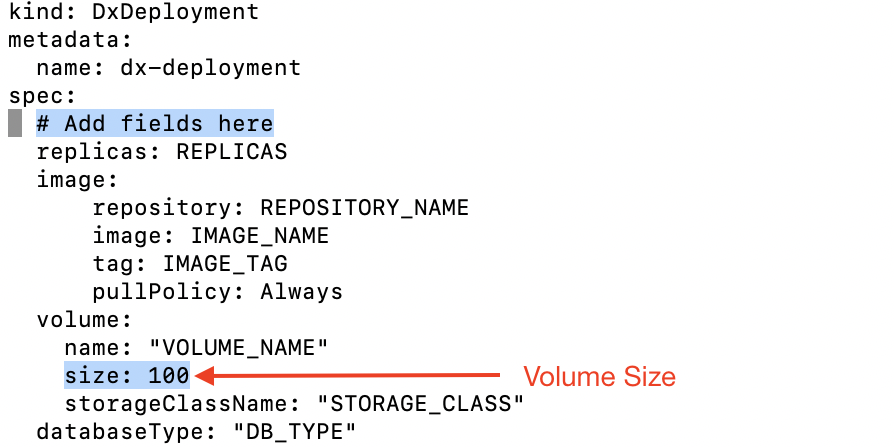
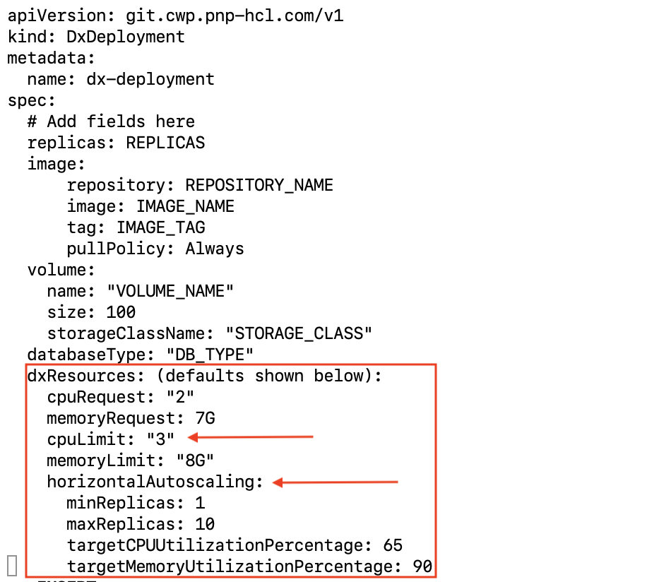
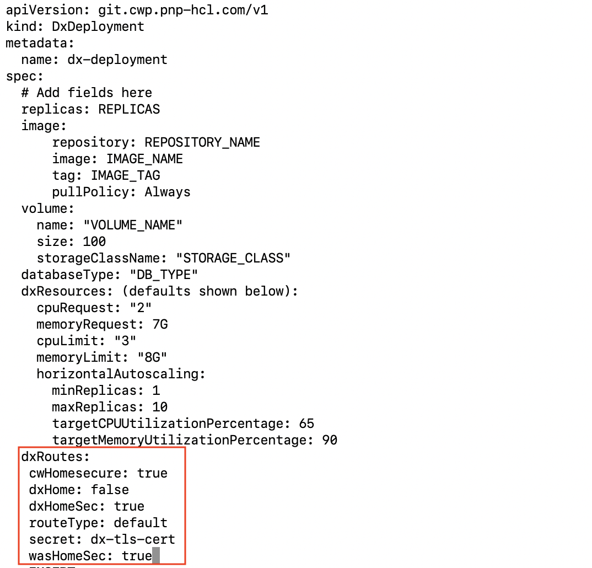
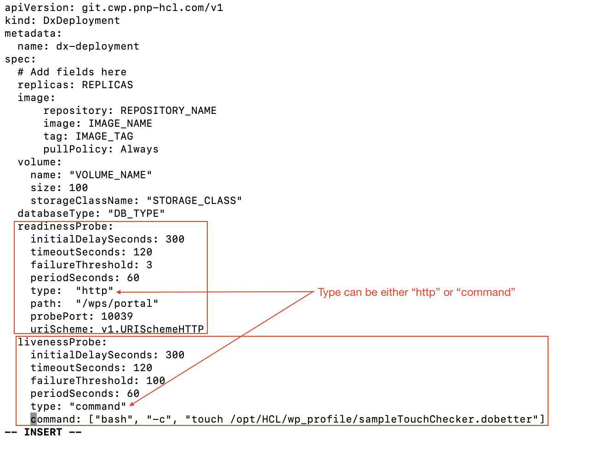
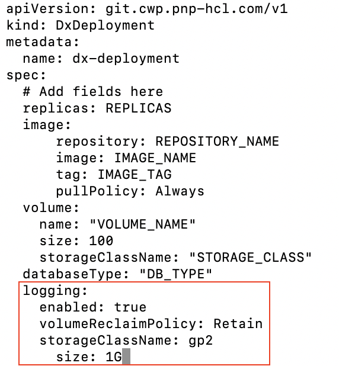
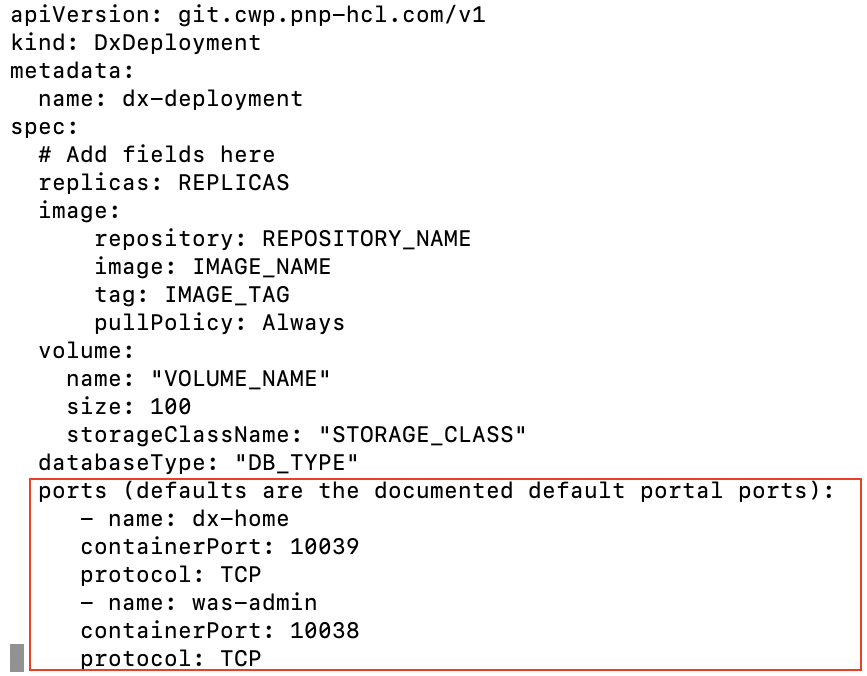

# Customizing the container deployment

This section describes how to customize your HCL Digital Experience 9.5 container deployment.

## About this task

Follow this procedure to deploy or update your HCL Portal deployment.

DX 9.5 containerization is focused on deployment and it uses an operator-based deployment.

**Goals**

-   To introduce a supported containerized deployment that HCL Digital Experience can continually extend to provide customers with the best possible experience.
-   To provide a high level of customization in the deployment and continue to expand on that, along with increased automation.

## Before you begin

Customers need to follow the recommended deployment model to ensure the availability of future functions and prevent potential conflicts.

Customizing the deployment requires updating the deploy/crds/git.cwp.pnp-hcl.com\_v1\_dxdeployment\_cr.yamlfile located in the hcl-dx-cloud-scripts/deploy/crds directory in the HCL Digital Experience 9.5 platform packages deployed.


Reference the HCL Digital Experience [Deployment topic](deployment.html) for the list of supported platforms and latest HCL DX 9.5 container package list files that can be downloaded from your HCL Digital Experience entitlements on the HCL Software License Portal.

Once modified, the `deployDx.sh` or the `updateDx.sh` scripts should be run to perform \(or update\) the target deployment.


**Note:** All modifications should be made to the custom resource instance and **not the individual parts** of the deployment.

## Procedure

1.  Create a backup of the git\_v1\_dxdeployment\_cr.yaml file.
2.  Open the original file in edit mode.
3.  Find the line with the text labeled `# Add fields here`. Customizations should be done below this line.
4.  Add the following customizations as applicable:
    -   Volume Size

        By default, the volume size is **100 GB**. This can be modified by changing the following:

        

        **Note:** The `volume name` and `storageClassName` should not be modified here.

    -   Resources

        By default, the resource requests are set at `**2**` CPU and `**7G**` RAM. These values can be changed. It is recommended to adjust the server heap size before changing these values.

        

        **Note:** Limits are not enforced in the initial 9.5 release.

    -   HCL DX 9.5 Container Update CF171 and higher
        -   Limits are enforced.
        -   Auto-scaling based on average CPU and memory utilization can be configured.

            **Auto-scaling**

            When using a Horizontal Pod Autoscale Service, by design, scaling up the amount of HCL DX 9.5 pods is done one at a time. HCL DX 9.5 processes will initiate the requested single instance at a given time until the instance starting is started, to manage scaling in a controlled manager from 1 to N minimum pods set.

            Each deployment takes approximately ~3 to 4 minutes to start, operating on typical hardware environments. Pod instance terminations are also managed with these control practices.

            Scaling is controlled in the configuration map with these settings, which can be configured. In this example, 5 is the maximum number of DX 9.5 Container pods requested:

            ```
            dx.deploy.dxcore.resources.scale.maxreplicas: '5'
            ```

            ```
            dx.deploy.dxcore.resources.scale.minreplicas: '1'
            ```

            

    -   Routes/Ingress

        By default in 9.5, base routes are created for the deployment.

        HCL DX 9.5 Container Update CF171 and higher allows a customer to configure the available routes.

        You can enable or disable any route and change the name of the secret to be used in the TLS context. The Configuration Wizard is still impacted by the number of running instances.

        

    -   Probes

        The default readiness and liveness probes run against the ../ibm/console. This can and should be overridden.

        

        **Notes:** There are two types of checks:

        -   `**command**` runs a command against the server
        -   `**http**` hits either an **http** or an **https** URL. The syntax and required fields are shown in the above image.
        -   **Logging**

            By default, logging is done on the shared profile so all instances are writing to a single set of logs, with the volume set for each instance at `**1G**`. For diagnosing production issues this is not ideal. This option allows each instance to write the log to its own log directory.

            

            **Notes:**

            -   The environment must have a self-provisioning storage class provisioner.
            -   `**Enabled**` must be set to `**true**`.
            -   Adjusting the log settings must be done to prevent running out of disk storage.

                See the [Logging and tracing for containers and new services](../trouble/logging_tracing_containers_and_new_services.md) Help Center topic for additional information.

        -   Ports

            By default, the deployment uses the default DX ports. The routes in these ports expose Portal through **http** and **https**.

            

            **Note:** If there is a need to configure the containerized Portal to use different ports, the defaults can be overwritten.

5.  Once modified, the `deployDx.sh` and the `updateDx.sh` scripts should be run to create \(or update\) the target deployment.

**Parent topic:**[Customizing your container deployment \| HCL Digital Experience](../containerization/customization.md)

