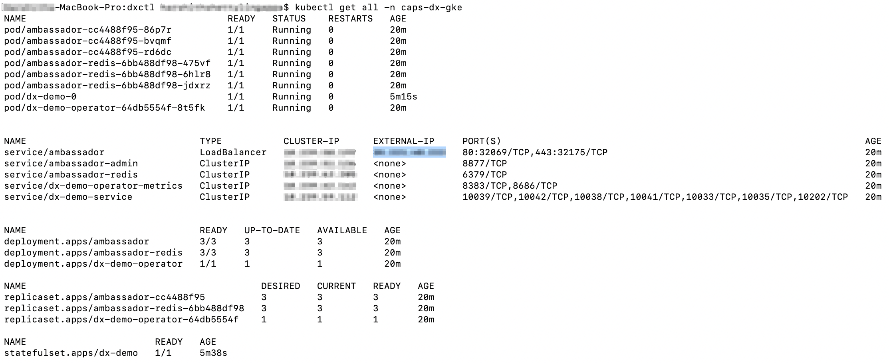
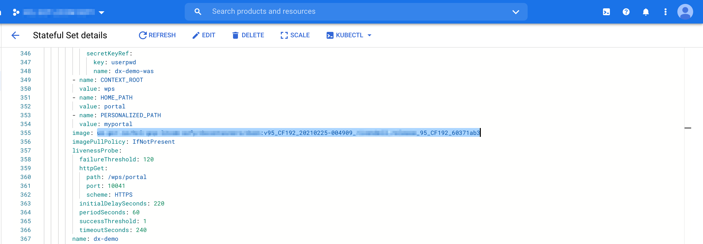

# Deploying DX CF192 and later release Containers to Google Kubernetes Engine \(GKE\)

Learn how to deploy HCL Digital Experience \(DX\) 9.5 CF192 and later release containers along with Ambassador to Kubernetes, as verified in [Google Kubernetes Engine \(GKE\)](https://console.cloud.google.com/marketplace/details/google-cloud-platform/container-engine).

## About this task

Follow these steps to deploy HCL Digital Experience 9.5 Container Update CF192 and later release along with Ambassador to Kubernetes, as verified in [Google Kubernetes Engine \(GKE\)](https://console.cloud.google.com/marketplace/details/google-cloud-platform/container-engine). This deployment relies heavily on Kubernetes Operators for full functionality.

**Note:** Refer to the latest HCL DX 9.5 Container Update Release CF192 and later file listings in the [Docker deployment](../containerization/docker.html) topic.

## Prerequisites

Prior to using the procedure below, it is assumed that the HCL DX Administrator is generally experienced in using Kubernetes. Additionally, the DX Administrator must have the appropriate access to the target environment. If not, following are some preliminary steps that need to be taken.

1.  Setup `KUBECONFIG` to refer to the target server. This ensures any `kubectl` commands executed locally affect the target environment. Use `kubectl get {pods, pv, storageclass}` to get appropriate information from the artifacts running in the target Kubernetes environment.

    

2.  Google Kubernetes Engine \(GKE\) Cluster
3.  Google Container Registry \(Or any other registry configured to use with GKE\)
4.  The following tools must be installed on your system:
    -   [Docker](https://hub.docker.com/)
    -   [kubectl](https://cloud.google.com/kubernetes-engine/docs/quickstart)
    -   [Google Cloud SDK](https://cloud.google.com/sdk/)
5.  Volume requirement:
    -   Requires an AccessMode of **ReadWriteMany**
    -   Requires a minimum of **40 GB**, with the default request set to **100 GB**
    -   RECLAIM POLICY = Retain
    -   For Digital Asset Management, additional volume is required.

        **Notes:**

        -   HCL Digital Experience is input-output \(I/O\) intensive and requires a high performing file system for optimization.
        -   There are various ways to do this and NFS is one option. For more details, see [NFS Server](#gke_nfs_server).
6.  For more information, see the [Detailed System Requirements](https://support.hcltechsw.com/csm?id=kb_article&sysparm_article=KB0013514&sys_kb_id=17d6296a1b5df34077761fc58d4bcb03) page.

## Download HCL Digital Experience 9.5 CF192 or later containers

1.  Download container

    Download HCL DX 9.5 CF192 or later package and extract it to the Local file system.

    **Note:** Here local can be a local system, or any other system that the administrator uses to connect to the Kubernetes cluster.

2.  Change directory

    Open a terminal window and change to the root directory of the extracted package.

3.  Docker load

    Load the containers into your Docker repository:

    -   ```
docker load < hcl-dx-core-image-v95_xxxxxxxx-xxxx.tar.gz
```

    -   ```
docker load < hcl-dx-ambassador-image-xxx.tar.gz 
```

    -   ```
docker load -i hcl-dx-cloud-operator-image-v95_xxxxxxxx-xxxx.tar.gz
```

    -   ```
docker load -i hcl-dx-image-processor-image-v95_xxxxxxxx-xxxx.tar.gz
```

    -   ```
docker load -i hcl-dx-digital-asset-management-operator-image-v95_xxxxxxxx-xxxx.tar.gz
```

    -   ```
docker load -i hcl-dx-postgres-image-v95_xxxxxxxx-xxxx.tar.gz
```

    -   ```
docker load -i hcl-dx-ringapi-image-v95_xxxxxxxx-xxxx.tar.gz
```

    -   ```
docker load -i hcl-dx-redis-image-xxx.tar.gz
```

        **Note:** Either **`-i`** or **`<`** works for the load command. In case you encounter an error when using one of the options, try running the command using the other.

4.  Docker tag and push

    Get the Docker images in your local Docker repository to your target Kubernetes system by tagging and pushing them appropriately. If you used `docker load` to get your images on the target environment, proceed to the next step.

    Syntax for tagging:

    ```
    docker tag <local image:tag or image id> <destination image:tag>
    ```

    Syntax for pushing:

    ```
    docker push <image:tag>
    ```


## Deployment

1.  Persistence volume

    Create \(or have the Kubernetes Administrator create\) a persistent volume and storage class where the AccessMode must be **ReadWriteMany** and the persistent volume reclaim policy must be **Retain**.

    

2.  NFS Server

    Provide the **HCL DX 9.5 CF192** and later Docker image access to the volume mount created in order to copy the profile.

    There are various ways to do this and NFS is one option. If NFS is used, here are the parameters that have been tested to work: `rw` \(Default\)

    -   `sync` \(Default after NFS 1.0, means that the server does not reply until after the commit\)
    -   `insecure`\*\* \(Requires requests originate on ports less than 1024\)
    -   `root_squash`\*\* \(Map requests to the nobody user\).
    -   `hard`\*\* \(Required because this means the system will keep trying to write until it works.\)
    -   `nfsvers=4.1`
    -   `rsize=8388608` \(Avoids dropped packages, default 8192\)
    -   `wsize=8388608` \(Avoids dropped packages, default 8192\)
    -   `timeo=600` \(60 seconds\)
    -   `retrans=2` \(Number of retries after a time out\)
    -   `noresvport`\*\* \(Tells the NFS client to use a new Transmission
    -   Control Protocol \(TCP\) source port when a network connection is reestablished. This helps to ensure that the EFS file system has uninterrupted availability after a network recovery event.

        **Note:** Those marked with \*\* are critical and, in many cases, it is recommended to have the `rsize` and `wsize` set to 8388608.

3.  Log in to cluster

    Before using the dxctl tool to deploy, you must be logged in to the targeted cluster using the cloud platform specific CLI \(like Red Hat OpenShift, Amazon EKS, Microsoft Azure AKS, Google GKE\).

    Command-line syntax:

    ```
    gcloud container clusters get-credentials cluster_name --region region_name --project project_name
    ```

    

4.  Change directory

    Change to the extracted files directory, ./hcl-dx-cloud-scripts.

    ```
    [root]$ cd  ./ hcl-dx-cloud-scripts
    ```

5.  Download HCL DX dxctl tool

    Instructions for downloading the latest packages, see [A Step-By-Step Guide to Downloading DX Products and Accessing Customer Support](https://support.hcltechsw.com/csm?id=kb_article&sysparm_article=KB0077878&sys_kb_id=2cde06a31b885494c48197d58d4bcbe2).

    -   Using DX Container Update CF192 and later, the directory structure might look as follows:

        

    For more information on dxctl tool, see [dxctl](dxtools_dxctl.md)

6.  Configuring the dxctl properties for the DX 95 CF192 or later deployment
    -   Copy one of the provided properties files to further modify your deployment.

        Syntax for copying the properties file:

        ```
        mkdir -p /home/$USER/deployments/
        ```

    -   The modified properties file can be used for the deployment, and the same must be used for any further updates.

        Syntax for deployment using the properties file:

        ```
        cp dxctl/properties/full-deployment.properties /home/$USER/deployments/myfirst_deployment.properties
        ```

    -   Update the dxctl properties file values.

        Syntax for updating the properties file:

        ```
        dx.namespace: caps-dx-gke
        dx.image: dxen
        dx.tag: v95_CF192_20210224-004909_xxxxxxxxx_95_CF192_6035c973
        dx.storageclass:dx-deploy-stg
        dx.volume: jen-core-pv
        dx.volume.size:60
        remote.search.enabled:false
        openldap.enabled:false
        api.enabled: false
        composer.enabled: false
        dam.enabled: false
        ingress.image:dx-build-output/common/ambassador
        ingress.tag:1.5.4
        ingress.redis.image:redis
        ingress.redis.tag:5.0.1
        dx.operator.image: dx-build-output/hcldx-cloud-operator/hcldx-cloud-operator
        dx.operator.tag: v95_CF192_20210225-0546_xxxxxxxxx_95_CF192
        ```

        **Important:** With HCL DX 9.5 Container Update CF197 and later, dam.features in full-deployment properties is added for use in a future container update release, and should not be modified except with direct guidance from HCL Support.

        **Note:** With HCL DX 9.5 Container Update CF193 and later, persist.force.read in full-deployment properties is added to enable a read-only Postgres pod for Digital Asset Management. This enables a failover capability for the Postgres service supporting DAM. Another option to enable a read-only pod is to set the persist.minreplicas: option set to greater than 1.

        Example:

        

7.  Deploying using HCL DX dxctl tool

    Run the following command to deploy a HCL DX 9.5 CF192 or later release container on Google Kubernetes Engine using dxctl.

    Syntax to deploy DX container:

    ```
    ./mac/dxctl --deploy -p /home/$USER/deployments/myfirst_deployment.properties
    ```

    

    **Note:** These steps result in a DX 95 CF192 or later deployment being created.


## Generate a TLS Certificate

1.  Create a TLS certification to be used by the deployment:
    -   For development purposes:
        -   Using OpenSSL, you can create a private key:

            ```
            openssl genrsa -out my-key.pem 2048
            ```

        -   Using OpenSSL, you can create a certificate signed by the private key:

            ```
            openssl req -x509 -key my-key.pem -out my-cert.pem -days 365 -subj '/CN=my-cert' -new
            ```

    -   Create a TLS certification:

        ```
        $ kubectl create secret tls dx-tls-cert --cert=my-cert.pem --key=my-key.pem -n caps-dx-gke
        ```

        **Note:** The default name is the `dx-tls-cert`, and this can be changed in the configuration. In the example, `caps-dx-gke` is the Kubernetes namespace. You can set your preferred namespace, but you must consistently use this namespace in subsequent commands.


## Final Output

The external IP from **Load balancer** in the below example can be used to access PORTAL.

Syntax for the output command:

```
$ kubectl get all -n NAMESPACE
```



The deployed system will be available at: https://external-ip/wps/portal, where external-ip is the IP address of your system.


## Update the HCL Digital Experience 9.5 GKE deployment to a later release

To update the deployment to a later HCL DX 9.5 Container Update release, perform the following steps:

1.  Update the deployment properties file with the new image values and run the Update command.
    -   On Mac

        ```
        ./mac/dxctl --update -p properties/myfirst_deployment.properties
        ```

        

        

        

    -   On Windows

        ```
        .\win\dxctl.exe --update -p properties\myfirst_deployment.properties
        ```

    -   On Linux

        ```
        ./linux/dxctl -–update -p properties/myfirst_deployment.properties
        ```

2.  **Note:** If using HCL DX 9.5 Container Update CF192 or later, the [dxctl](dxtools_dxctl.md) tool can be used to Update the deployment.

    The dxctl tool does not deploy or update the DxDeployment custom resource definition. Prior to running an Update process, administrators should check the DxDeployment custom resource definition \(`hcl-dx-cloud-scripts/deploy/crds/git.cwp.pnp-hcl.com_dxdeployments_crd.yaml`\) for changes and update accordingly:

    -   **Kubernetes command:**

        ```
        kubectl delete crd dxdeployments.git.cwp.pnp-hcl.com
        ```

        CAUTION:

        Since `crd` is a cluster-wide resource, the use of `kubectl delete crd dxdeployments.git.cwp.pnp-hcl.com` causes a service outage for all the **dx-deployment** across the cluster.

    -   **Kubernetes command:**

        ```
        kubectl create -f deploy/crds/git.cwp.pnp-hcl.com_dxdeployments_crd.yaml
        ```


**Additional considerations:** Once the database is transferred, the **DBTYPE** might need to be updated, so you can scale the instances higher. Additionally, once the database is transferred, the number of replicas could be increased.

## Delete the HCL Digital Experience 9.5 GKE deployment

1.  Removing the entire deployment requires several steps, this is by design.
    -   Remove the deployment but allow for redeployment with the same volumes:

        ```
        ./linux/dxctl --destroy -p properties/hybrid-deployment.properties
        ```

    -   Remove the entire namespace/project:

        ```
        ./linux/dxctl --destroy -p properties/hybrid-deployment.properties -all true
        ```

        

        If you still find some resources like services that are not deleted, run the following command:

        ```
        kubectl patch services $(kubectl get services -n $NAMESPACE  | grep -v "NAME" |awk  '{print $1}') 
        -p '{"metadata":{"finalizers":null}}' -n $NAMESPACE
        ```


**Parent topic:**[Deploying HCL Digital Experience Containers to Google Kubernetes Engine \(GKE\)](../containerization/google_gke.md)

