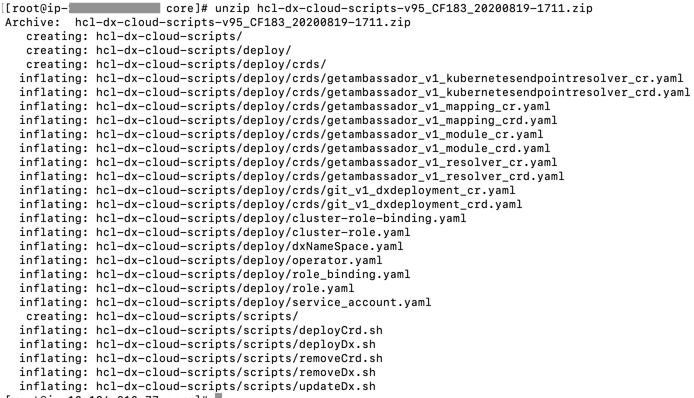
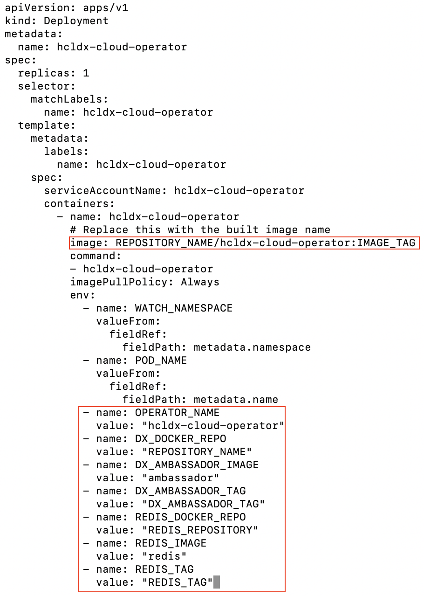

# Deploy DX CF191 and earlier release Containers to Amazon EKS

This section describes how to deploy HCL Digital Experience 9.5 CF191 and earlier release containers, along with the Ambassador, to Kubernetes as verified in [Amazon Elastic Kubernetes Service \(Amazon EKS\)](https://aws.amazon.com/eks/).

## Prerequisites

Prior to using the procedure below, it is assumed that the HCL DX Administrator is generally experienced in using Kubernetes. Additionally, the DX Administrator must have the appropriate access to the target environment. If not, following are some preliminary steps that need to be taken.

-   Setup `KUBECONFIG` to refer to the target server. This will ensure any `kubectl` commands executed locally affect the target environment.
-   Amazon EKS Cluster
-   The following tools must be installed on a machine other than the Portal server:
    -   Docker
    -   AWS Command Line Interface \(CLI\) - used to get image details.
-   Volume requirement:
    -   Requires an AccessMode of ReadWriteMany
    -   Requires a minimum of **40 GB**, with the default request set to **100 GB**
    -   RECLAIM POLICY = Retain
    -   For DAM, additional volume is needed. For more details on storage class and volume, see [Sample storage class and volume](sample_storage_class_volume.md).

        **Note:** HCL Digital Experience is input-output \(I/O\) intensive which requires a high performing file system for optimization; NFS is an option for this.

-   Hardware:
    -   4 cores / 7 GB - - - 5 cores / 9 GB
-   Amazon Elastic Container Registry \(ECR\) or any container registry access, for tagging and pushing.
-   See the support topic for the [HCL Digital Experience detailed system requirements](https://support.hcltechsw.com/csm?id=kb_article&sysparm_article=KB0013514&sys_kb_id=17d6296a1b5df34077761fc58d4bcb03).
-   Download and extract the contents of the HCL DX 9.5 package to the local \(local to cloud or system\).

    If deploying HCL Digital Experience 9.5 Container Update release, the image and package names are as follows:

    `CF183-core.zip` files:

    -   `HCL DX notices V9.5 CF183.txt`
    -   `hcl-dx-ambassador-image-154.tar.gz`
    -   `hcl-dx-cloud-operator-image-v95_CF183_20200819-1711.tar.gz`
    -   `hcl-dx-cloud-scripts-v95_CF183_20200819-1711.zip`
    -   `hcl-dx-core-image-v95_CF183_20200819-1159.tar.gz`
    -   `hcl-dx-redis-image-5.0.1.tar.gz`
    **Note:** Images included in the ‘other’ package released with CF183 are optional and used to support use of OpenLDAP, Remote Search, the Experience API, Content Composer, and Digital Asset Management components and services.


## About this task

Follow these steps to deploy HCL Digital Experience 9.5 CF183 and higher container release, along with Ambassador to Kubernetes, as verified in [Amazon Elastic Kubernetes Service \(Amazon EKS\)](https://aws.amazon.com/eks/). This deployment relies heavily on Kubernetes Operators for full functionality.

**Note:** Reference the latest HCL DX 9.5 Container Release and Update file listings in the [Docker deployment](../containerization/docker.md) topic.

## DX Container Management

1.  Change directory

    Open a terminal window and change to the root directory of the extracted package.

2.  Docker load

    Load the containers into your Docker repository:

    -   ```
docker load < hcl-dx-core-image-v95_CF183_20200819-1159.tar.gz
```

    -   ```
docker load < hcl-dx-ambassador-image-154.tar.gz
```

    -   ```
docker load < hcl-dx-cloud-operator-image-v95_CF183_20200819-1711.tar.gz
```

    -   ```
docker load < hcl-dx-redis-image-5.0.1.tar.gz
```

    **Note:** Either **`-i`** or **`<`** works for the load command. In case you encounter an error when using one, try running the command using the other.

    

3.  Docker tag and push

    Get the Docker images in your local Docker repository to your target Kubernetes system by tagging and pushing them appropriately. If you used `docker load` to get your images on the target environment, proceed to the next step.

    -   ```
docker tag <local image:tag or image id> <destination image:tag>
```

    -   ```
docker push <image:tag>
```


## DX Deployment

1.  Unzip

    Extract the HCL DX deployment scripts onto your environment as follows:

    ```
    unzip hcl-dx-cloud-scripts-v95_CF183_20200819-1711.zip
    ```

    

2.  Change directory

    Change to the extracted files directory,

    ```
    cd hcl-dx-cloud-scripts
    ```

3.  Custom resource definition

    Install the DxDeployment custom resource definition.

    -   Do not modify the git\_v1\_dxdeployment\_crd.yaml file.
    -   Customize ./deploy/crds/git\_v1\_dxdeployment\_cr.yaml, if required
    Use either of the following commands:

    -   ```
kubectl create -f hcl-dx-cloud-scripts/deploy/crds/git_v1_dxdeployment_crd.yaml
```

    -   ```
./scripts/deployCrd.sh
```

4.  Persistence volume

    Create \(or have the Kubernetes Administrator create\) a persistent volume and storage class where the AccessMode must be **ReadWriteMany** and the persistent volume reclaim policy must be **Retain**.

    

    For more details on storage class and volume, see [Sample storage class and volume](sample_storage_class_volume.md)

5.  NFS server

    Provide the HCL DX 9.5 CF183 and higher Docker image access to the volume mount created in order to copy the profile. There are various ways to do this and NFS is one option. If NFS is used, here are the parameters that have been tested to work:

    -   `rw,` \(Default\)

    -   `sync`, \(Default after NFS 1.0, means that the server does not reply until after the commit\)

    -   `insecure`,\*\* \(Requires requests originate on ports less than 1024\)

    -   `root_squash`,\*\* \(Map requests to the nobody user\).

    -   `hard`,\*\* \(Required because this means the system will keep trying to write until it works.\)

    -   `nfsvers=4.1`,

    -   `rsize=8388608`, \(Avoids dropped packages, default 8192\)

    -   `wsize=8388608`, \(Avoids dropped packages, default 8192\)

    -   `timeo=600`, \(60 seconds\)

    -   `retrans=2`, \(Number of retries after a time out\)

    -   `noresvport`\*\* \(Tells the NFS client to use a new Transmission Control Protocol \(TCP\) source port when a network connection is reestablished. Doing this helps make sure that the EFS file system has uninterrupted availability after a network recovery event.\)

        **Note:** Those marked with \*\* are critical and, in many cases, it is recommended to have the `rsize` and `wsize` set to **8388608**.

6.  Update YAML

    Replace the **REPOSITORY NAME**, **IMAGE TAG**, **AMBASSADOR**, and **REDIS** values in `operator.yaml`

    

    

7.  Deploy

    Create the DX container deployment.

    Run the `deployDx.sh` script to create the namespace, install the project scoped service account, role, role binding, operator, and deployment.

    ```
    ./scripts/deployDx.sh NAMESPACE REPLICAS REPOSITORY IMAGENAME IMAGETAG VOLUMENAME STORAGECLASS DBTYPE INGRESSIMAGE INGRESSTAG
    ```

    -   **NAMESPACE** - the project or the namespace to create or use for deployment. This namespace will be used in subsequent commands.
    -   **REPLICAS** - the number of initial instances for the deployment.
    -   **REPOSITORY** - your local repository, the repository used by Kubernetes.
    -   **IMAGENAME** - the name of the dxCore image, as added to the repository above.
    -   **IMAGETAG** - the tag for the target image as added to the repository above.
    -   **VOLUMENAME** - the volume to be used by the deployment for persistence, this must use **AccessMode** **ReadWriteMany**.
    -   **STORAGECLASS** - the storage class name used to create the persistent volume.
    -   **DBTYPE** - the database type. By default, and initially, this is Derby. HCL DX 9.5 uses Apache Derby, Oracle Database, IBM DB2, or Microsoft SQL Server. Acceptable values are `derby`, `oracle`, `db2`, or `msSql`.
    -   **INGRESSIMAGE** - The image name to use for ambassador \(Native K8s\).
    -   **INGRESSTAG** - The image tag to use for ambassador \(Native K8s\).
    For example:

    ```
    $cd hcl-dx-cloud-scripts
    
    $scripts/deployDx.sh dx-11 1 REPO_NAME dxen v95_CF183_20200818-1342 dx-pv-11 dx-deploy-stg derby ambassador 154
    ```

    


## Generate TLS Certificate

Create a TLS certification to be used by the deployment:

-   For development purposes:
    -   Using OpenSSL, you can create a private key:

        ```
        openssl genrsa -out my-key.pem 2048
        ```

    -   Using OpenSSL, you can create a certificate signed by the private key:

        ```
        openssl req -x509 -key my-key.pem -out my-cert.pem -days 365 -subj '/CN=my-cert
        ```

-   Create a TLS certification:

    ```
    kubectl create secret tls dx-tls-cert --cert=my-cert.pem --key=my-key.pem -n aws-mynamespace
    ```

    **Note:** The default name is the `dx-tls-cert` this can be changed in the configuration. `aws-mynamespace` is your Kubernetes namespace. You can set your preferred namespace but you must consistently use this namespace in subsequent commands. See [Customizing the Kubernetes deployment](customizing_kubernetes_eks_deployment.md).


## Final Output

External IP from **Load balancer** in the below example can be used to access PORTAL

-   Output

    ```
    $ kubectl get all -n NAMESPACE
    ```

    

    ```
    https://EXTERNAL_IP/wps/portal
    ```

    


**Parent topic:**[Deploy DX Container to Amazon EKS](../containerization/deploy_kubernetes_eks.md)

