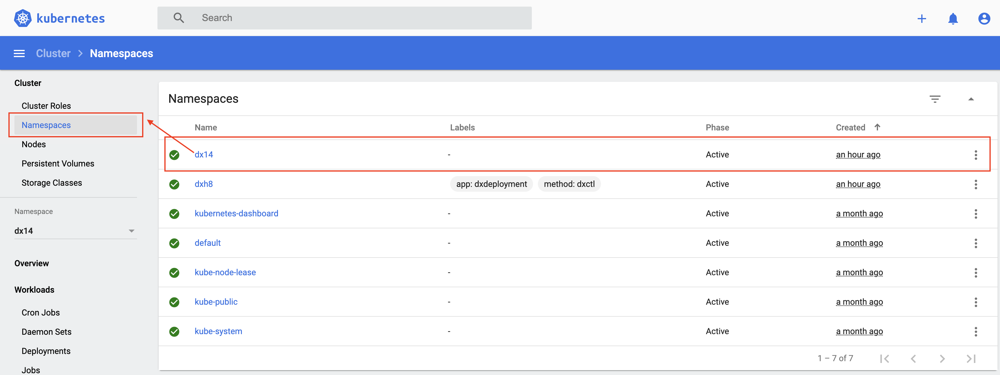
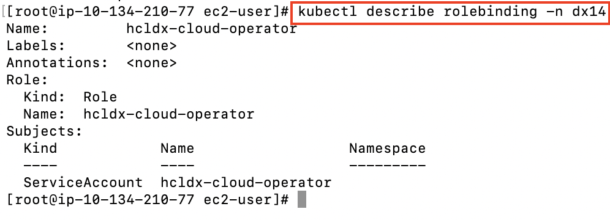
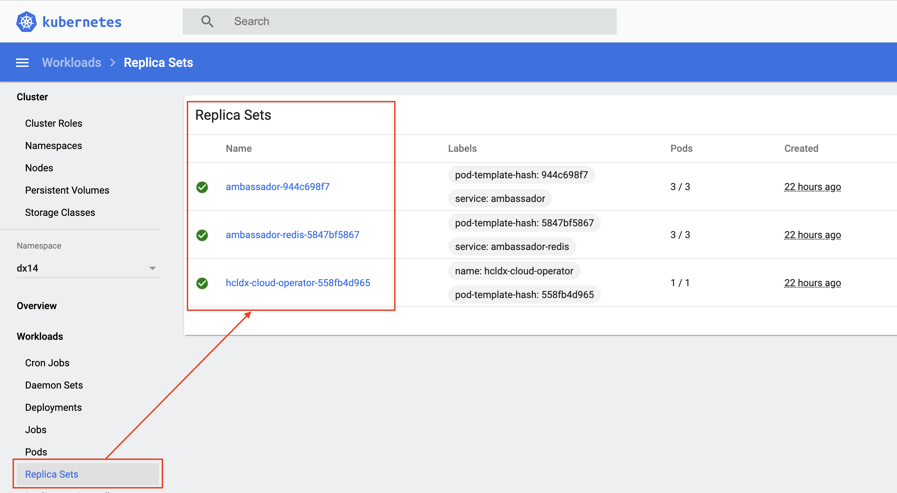
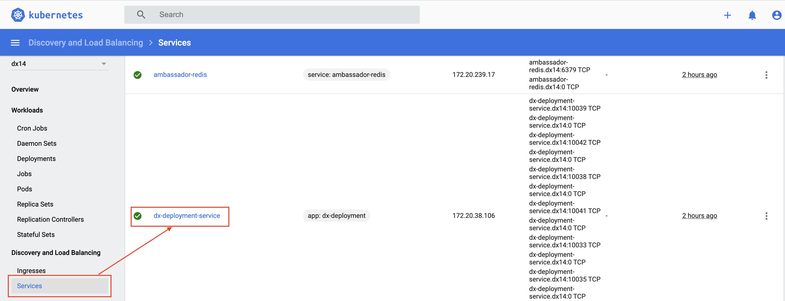
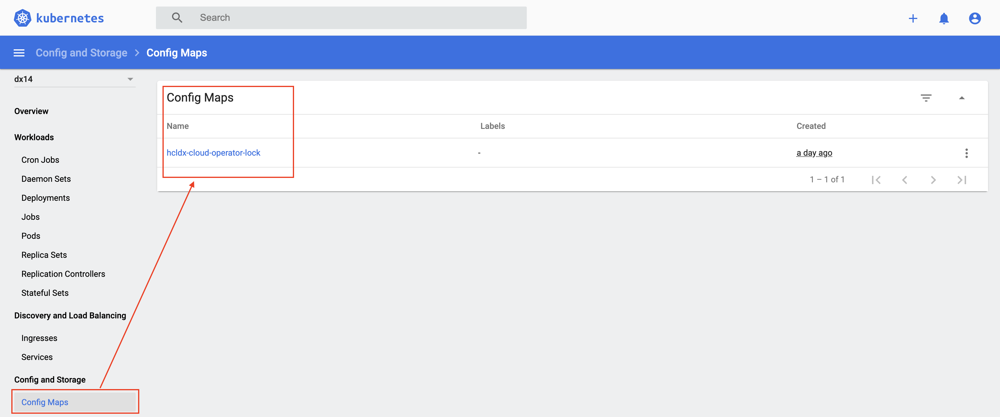
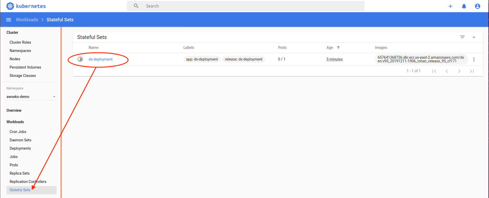
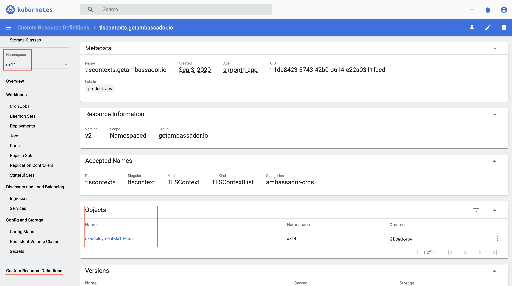
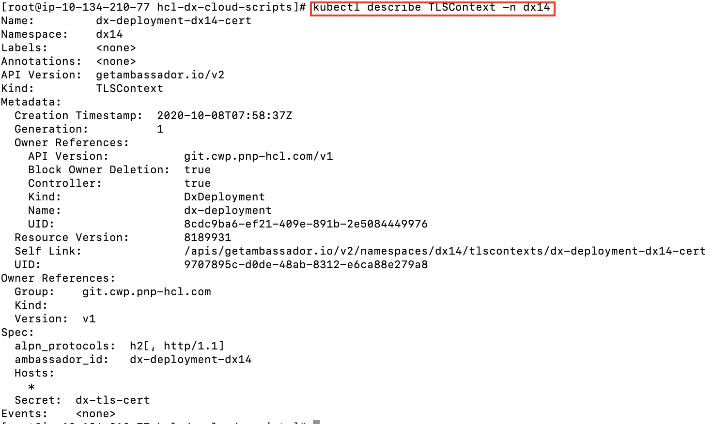

# Understanding the HCL DX 9.5 container deployment on Amazon EKS

This section describes the output and artifacts created when deploying HCL Digital Experience 9.5 container release in on Amazon Elastic Kubernetes Service \(EKS\).

**Note:** All modifications must be done on the custom resource instance and not the individual pieces of the deployment. See [Customizing the Kubernetes deployment](customizing_kubernetes_eks_deployment.md) for details.

Deploy with the following command:

```
./scripts/deployDx.sh dx14 1 AWS_OWNER_ID.dkr.ecr.us-east-2.amazonaws.com dxen v95_CF184_20200916-2009 dxh1-dam dx deploy-stg derby ambassador 154
```

Results in the following output:

```
Namespace:  dx14
- REPLICAS:  1
- Repository:  AWS_OWNER_ID.dkr.ecr.us-east-2.amazonaws.com
- Image Name:  dxen
- Image Tag:  v95_CF184_20200916-2009
- Volume Name:  dxh1-dam
- Storage Class Name:  dx-deploy-stg
- Database Type:  derby
-
namespace/awseks-demo created
serviceaccount/hcldx-cloud-operator created
role.rbac.authorization.k8s.io/hcldx-cloud-operator created
rolebinding.rbac.authorization.k8s.io/hcldx-cloud-operator created
deployment.apps/hcldx-cloud-operator created
dxdeployment.git.cwp.pnp-hcl.com/dx-deployment created
```

The following artifacts are created during deployment:

## Artifacts

Project/Namespace

The **Project**/**Namespace** gets created if it does not already exist.

The Kubernetes Dashboard can be installed on your local using the following link: [https://kubernetes.io/docs/tasks/access-application-cluster/web-ui-dashboard/](https://kubernetes.io/docs/tasks/access-application-cluster/web-ui-dashboard/)



```
kubectl get namespaces
```


Service Account

**Service Accounts** for the operator and ambassador deployments.

```
kubectl get serviceaccounts -n dx14
```


Role

A **Role** that defines the access required by the operator.

```
kubectl get role -n dx14
```

For more detailed information, use the `describe` command.


Role Binding

A **Role Binding** that binds the operator service account to the operator role.

```
kubectl describe rolebinding -n dx14
```



Deployment

A **Deployment** that defines/describes the operator Replica Set.


```
kubectl get deployment -n dx14
```


Replica Sets

**Replica Sets** based on the deployments of the ambassador and the operator, that maintains a stable set of replica pods.



```
kubectl get replicaset -n dx14
```


Metrics and Services

Services expose HCL Digital Experience running as part of the Stateful Set and provide metrics for the operator created.



```
kubectl get service -n dx14
```


Secrets

There are several secrets that are created.


```
kubectl get secrets -n dx14
```

```
kubectl describe secret dx-deployment-wps -n dx14
```

 sample with CLI")

Kubernetes command to update existing secrets:

```
kubectl edit secret dx-deployment-wps -n dx14
```

Use `base64` encoded values when updating secrets. Most Linux operating systems will allow you to generate `base64` values with this command:

```
echo 'wpsadmin' | base64
```

Config Map

A **Config Map** is created to handle clustering in scenarios where multiple operators are deployed.



```
kubectl get configmap -n dx14
```


Persistent Volume Claims

One or more **Persistent Volume Claims** are created, one for the shared profile, and another, if configured, for the logs of each pod.


```
kubectl get pvc -n dx14
```


Stateful Set

A **Stateful Set** is created for the HCL Digital Experience core. A Stateful Set manages pods that are based on an identical container specification.



```
kubectl get statefulset -n dx14
```


Pods

**Pods** are part of the Stateful Set, running HCL Portal.


`kubectl get pods -l app=dx-deployment -n dx14'` \(limits to pods in the StatefulSetSpec\)

```
kubectl get pods -n dx14
```


Ambassador

To expose the DX server, HCL is leveraging [Ambassador](https://www.getambassador.io/docs/). Ambassador is deployed and configured by default. There are many artifacts included.

-   Custom resources that help define Ambassador: `AuthService`, `ConsulResolver`, `KubernetesEndpointResolver`, `KubernetesServiceResolver`, `Mapping`, `Module`, `RateLimitService`, `TCPMapping`, `TLSContext`, `TracingService`.
-   Ambassador deployment
-   Ambassador replica set
-   Ambassador pods \(by default, 3\)
-   Ambassador service and Ambassador admin service
-   An instance of TLS context

    

    ```
    kubectl describe TLSContext -n dx14
    ```

    


Mapping

An instance of **Mapping** for each target: DX Home Secure, WAS Home Secure, etc.


```
kubectl get mapping -n dx14
```


Extras

There are several files created for each deployment. It is recommended to keep these files.


-   File 1 `dxNameSpace_NAMESPACE.yaml` can be used to delete the `namespace`/`project` if needed.
-   File 2 `git_v1_dxdeployment_cr_NAMESPACE.yaml` is a representation of the last deployed deployment for the given `namespace`/`project`.

**Note:** With multiple instances of Digital Experience 9.5 containers writing to a shared **[Transaction log](https://www.ibm.com/support/knowledgecenter/SSEQTP_9.0.5/com.ibm.websphere.base.doc/ae/tjta_settlog.html)** \(tranlog\) directory, there is a possibility of data corruption which could lead to DX server startup issues. To avoid this possibility, beginning with CF192, for each DX 9.5 instance the deployment creates an additional dynamic Persistent Volume \(pv\) and Persistent Volume Claim \(pvc\) to contain the tranlog data of the individual instances.

**Parent topic:**[Deploy DX Container to Amazon EKS \| HCL Digital Experience](../containerization/kubernetes_eks.md)

